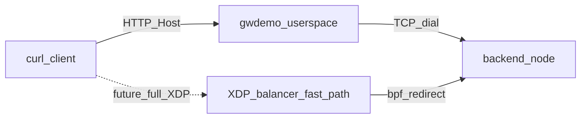

# Userspace gateway demo (getting started)

This walkthrough runs the **same reverse-proxy routing logic** used in tests ([`gateway.go`](gateway.go)): peek the first TCP bytes, parse **HTTP `Host:`** or **TLS SNI**, pick a **Maglev** backend, track the flow in a **conntrack** table, then open a TCP connection to the real backend and splice traffic both ways.

It does **not** load XDP/BPF. Use it for a reliable live demo (multiple VMs, `curl`, two services).

## What you need

- **One gateway host** (VM or laptop): runs `gwdemo`.
- **Two or more backend hosts** (can be VMs on the same LAN, or extra terminals on one laptop): each runs `simplebackend` (or any HTTP/1.1 server that returns a distinct body).
- **IPv4** only (the simulator’s 5-tuple key uses IPv4).
- **Network**: from the gateway, TCP to each backend `ip:port` must be allowed (cloud security group / `ufw` / etc.).
- **Go 1.21+** on the machine where you build.

## Network and security groups (two-node / cloud)

Open exactly what you need:

| Direction | Port | Purpose |
|-----------|------|---------|
| **Client → gateway** | TCP `listen` port (e.g. 80 or 8080) | `curl` hits the gateway. |
| **Gateway → backend A** | TCP backend port (e.g. 8081) | Gateway dials `address` in JSON. |
| **Gateway → backend B** | TCP backend port (e.g. 8082) | Same. |

You **do not** need client → backend rules; traffic is proxied through the gateway process.

Examples:

- **AWS**: security group on gateway allows inbound from your laptop CIDR on `8080/tcp`; each backend SG allows inbound **only from the gateway’s SG** (or private subnet) on its app port.
- **`ufw` on a backend**: `ufw allow from GATEWAY_IP to any port 8081 proto tcp`.

## Repository layout

| Path | Purpose |
|------|---------|
| [`cmd/gwdemo/main.go`](cmd/gwdemo/main.go) | Gateway process; reads JSON config |
| [`cmd/simplebackend/main.go`](cmd/simplebackend/main.go) | Tiny HTTP server for each backend node |
| [`gwdemo.example.json`](gwdemo.example.json) | Example config for local smoke test (edit IPs for multi-node) |

## Quick smoke test (one machine, four terminals)

From the `packetXpress/sim` directory:

1. **Backend 1** (Maglev pool for `alpha.demo`):

   ```bash
   go run ./cmd/simplebackend -listen 127.0.0.1:9001 -id b1
   ```

2. **Backend 2** (second member of same pool):

   ```bash
   go run ./cmd/simplebackend -listen 127.0.0.1:9002 -id b2
   ```

3. **Backend 3** (`beta.demo` only):

   ```bash
   go run ./cmd/simplebackend -listen 127.0.0.1:9003 -id b3
   ```

4. **Gateway** (uses [`gwdemo.example.json`](gwdemo.example.json)):

   ```bash
   go run ./cmd/gwdemo -config gwdemo.example.json
   ```

5. **Client** (`curl`):

   ```bash
   curl -sS -H 'Host: alpha.demo' 'http://127.0.0.1:8080/'
   curl -sS -H 'Host: beta.demo' 'http://127.0.0.1:8080/'
   ```

The first command returns JSON with `"backend":"b1"` or `"b2"` (Maglev pick for that flow). The second always hits `b3`. That proves **virtual-host routing** and **per-service backends**.

## Step 1: Build binaries

On a machine with Go (your laptop or the gateway):

```bash
cd packetXpress/sim
go build -o gwdemo ./cmd/gwdemo
go build -o simplebackend ./cmd/simplebackend
```

Copy `simplebackend` to each backend host (or build there with the same `go.mod`).

## Step 2: Start backends (two nodes)

On **backend A** (bind `0.0.0.0` so the gateway can reach the process over the LAN):

```bash
./simplebackend -listen 0.0.0.0:8081 -id backend-a
```

On **backend B**:

```bash
./simplebackend -listen 0.0.0.0:8082 -id backend-b
```

Each server responds with JSON like `{"backend":"backend-a",...}` and header `X-Backend-ID`.

## Step 3: Write gateway config

On the **gateway** host, create `mydemo.json` (edit IPs/ports to match your lab):

```json
{
  "listen": "0.0.0.0:80",
  "services": [
    {
      "hostname": "alpha.demo",
      "backends": [
        { "id": "b1", "address": "10.0.0.10:8081" }
      ]
    },
    {
      "hostname": "beta.demo",
      "backends": [
        { "id": "b2", "address": "10.0.0.11:8082" }
      ]
    }
  ]
}
```

Rules:

- `hostname` is exactly what clients send in **HTTP `Host:`** (or in **TLS SNI** for HTTPS pass-through).
- `address` is `host:port` reachable **from the gateway** (not from the client).
- Multiple backends under one hostname are load-balanced with **Maglev** on the 5-tuple; the same TCP connection stays pinned (conntrack).

If port 80 is privileged on Linux, use `"listen": "0.0.0.0:8080"` and point `curl` at port `8080` below.

## Step 4: Run the gateway

```bash
./gwdemo -config mydemo.json
```

Confirm it logs the listen address and registered services.

## Step 5: Curl from a client

Replace `GATEWAY_IP` with the gateway’s IPv4 address.

**Option A — virtual host without DNS** (`curl` 7.68+):

```bash
curl -sS --connect-to 'alpha.demo:80:GATEWAY_IP:80' 'http://alpha.demo/'
curl -sS --connect-to 'beta.demo:80:GATEWAY_IP:80' 'http://beta.demo/'
```

If the gateway listens on `8080`:

```bash
curl -sS --connect-to 'alpha.demo:80:GATEWAY_IP:8080' 'http://alpha.demo/'
```

**Option A2 — `--resolve` (alternative virtual host routing)**:

```bash
curl -sS --resolve 'alpha.demo:80:GATEWAY_IP' 'http://alpha.demo/'
curl -sS --resolve 'beta.demo:80:GATEWAY_IP' 'http://beta.demo/'
```

Use the same port in `--resolve` as the gateway’s listen port (e.g. `alpha.demo:8080:GATEWAY_IP` when the gateway listens on 8080).

**Option B — explicit Host header**:

```bash
curl -sS -H 'Host: alpha.demo' 'http://GATEWAY_IP/'
curl -sS -H 'Host: beta.demo' 'http://GATEWAY_IP/'
```

You should see **different JSON** bodies (`backend-a` vs `backend-b` if you used those `-id` values), proving routing to the correct node.

## Step 6: Optional checks

- **Unknown host**: `curl -H 'Host: unknown.invalid' http://GATEWAY_IP/` — connection should drop or hang briefly (no route).
- **Automated tests** (no VMs): from `packetXpress/sim`:

  ```bash
  go test -v -count=1 .
  ```

## TLS (SNI) note

The gateway can **TCP-forward** TLS: the client’s ClientHello (with SNI) is replayed to the backend. Backends must present a certificate the client trusts. The included `simplebackend` is HTTP-only; for HTTPS demos use real backends or extend `simplebackend` with TLS.

## Troubleshooting

| Symptom | Likely cause |
|---------|----------------|
| Gateway logs `dial backend ... connection refused` | Wrong `address` in JSON, backend not listening on `0.0.0.0`, or firewall between gateway and backend. |
| `curl` hangs | Security group blocks **client → gateway**, or wrong `GATEWAY_IP`. |
| Same response for both hostnames | Same `Host` sent twice, or config points both services to the same backend address. |
| Panic / empty IP in logs | IPv6-only addresses; use IPv4 for this demo stack. |

## Relation to XDP

The BPF balancer in [`packetXpress/bpf/pxp_balancer.c`](../bpf/pxp_balancer.c) is aimed at the same **5-tuple conntrack + DNAT** fast path; this userspace `Gateway` lets you **demo routing and Maglev** without kernel XDP, pinned maps, or return-path SNAT.

---

## Optional: talking points if you show BPF (do not over-claim)

Use this section for a **one-slide** bridge from the userspace demo to the kernel dataplane.

**What to say:** the in-repo XDP program implements a **fast path** (conntrack hit → rewrite destination IP/MAC, fix checksums, `bpf_redirect` toward the backend). New flows are designed to go to an **AF_XDP slow path** (SNI/Host → pick backend → install conntrack); **return traffic SNAT** on backends is described in comments but **not implemented** in this tree. So: *“same 5-tuple + Maglev idea; production would wire slow path + symmetric NAT.”*

**High-level flow (simplified):**



**Code pointer (fast path excerpt):** conntrack lookup, rewrite, redirect — see [`pxp_balancer.c`](../bpf/pxp_balancer.c) (`pxp_balancer`, `rp_flow_ct` / `rp_backends` maps).

**Honest scope for a live audience:** this demo proves **hostname-based routing and Maglev** in userspace; it does **not** prove end-to-end **XDP L4 reverse proxy** through the NIC without additional work (slow path daemon, populated maps, L2 topology, return path).
